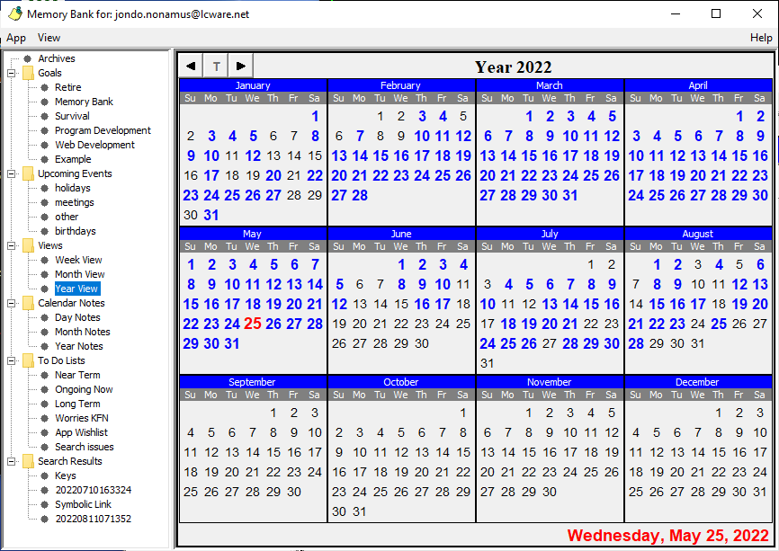
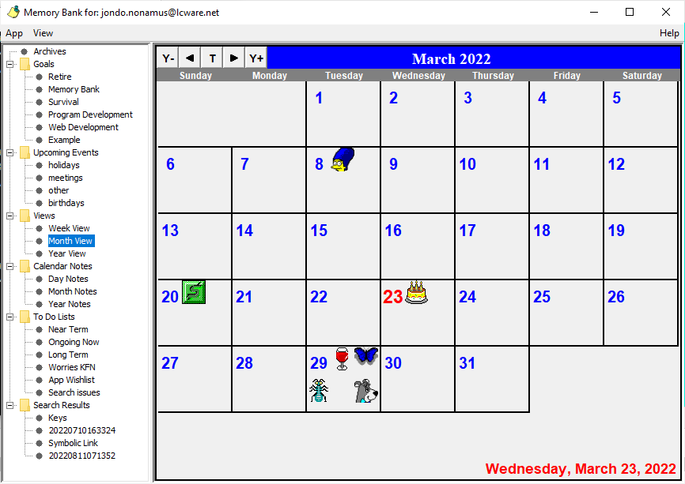

# Memory Bank
For anyone who wants a little help in recalling what happened when, and why - this app allows 
you to make date-related notes that you can later recall via a calendar or a keyword search.  It further 
provides a way to help in planning and documenting progress towards goals.  The level of detail 
is left to the user; it could be hour-to-hour in a day, or a note on the occasional month.  Note 
decoration with icon images is also possible and makes for a more interesting and
colorful display, especially on the Month view.  See the help files for much more info on 
controls, dialogs and views.

  
  
[Help Documentation](src/main/resources/help/markdown/TableOfContents.md)

