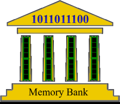

# Memory Bank  
For anyone who wants a little help in recalling what happened when, and why - this app allows you 
to make date-related notes that you can later find via a calendar or a keyword search.  It further 
provides a way to help in planning and documenting progress towards goals.  The level of detail 
is left to the user; it could be hour-to-hour in a day, or a note on the occasional month.  Note 
decoration with icon images is also possible and makes for a more interesting and
colorful display, especially on the Month view.  See the help files for much more info on 
controls, dialogs and views.  

| <h1>Developer Info |  |
|--------------------|---------------------------------------------:|

**[Data Locations](src/main/resources/help/markdown/Data%20Locations.md)** - 
Program and User data locations for various execution environments.  
**[Build Configurations](src/main/resources/help/markdown/Building.md)** - 
Various ways to build the code.  
**[Running](src/main/resources/help/markdown/Running.md)** - How to run the app.    
**[User Help Information](src/main/resources/help/markdown/TableOfContents.md)**  

While the application is 100% Java and therefore can run on any 
JVM-capable OS, recent work has all been targeted for Windows 10.  

