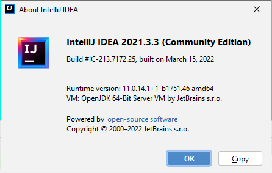

# Building the Code

The easiest build is via the IDE, IF you are using the same (or close enough) 
IntelliJ that I do, which at the moment is:  
  
The IDE can build and run the code directly, OR it can build a jar file (under Build Artifacts) 
that you would run later.  But be aware that there are significant differences in data
accesses, depending on whether you run from the ide or a jar.

All the relevant ide files are provided, so you could load the project
into IntelliJ as soon as you clone the repo.  This is important in order to get
the right library references, run configurations, and more.  Otherwise, there
could be a LOT more work (and headaches).

You can also use the Maven plugin to build a jar file in the target directory; a .pom file
is provided that _should_ bring in all the external libraries you will need.  The Maven
build can be done either from the ide or via command-line:   mvn clean package.

And finally there are some script files that I use to issue a series of command-line
statements to create yet a third variant of the jar file.  But these scripts 
utilize a non-supplied local directory that I keep, called C:\jars, which holds
all the referenced external libraries.  Keeping them all in one place is a 
convenience trick which simplifies command-line statements and you can do the same
thing but I cannot supply those libraries; you will need to download
them yourself to your own development environment.

